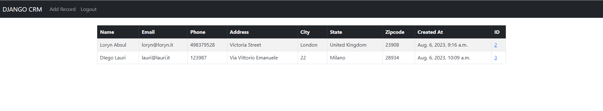
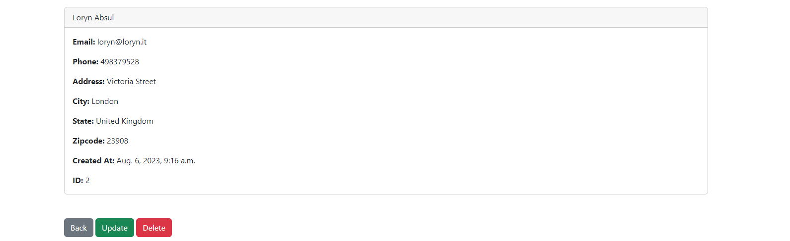

# 🚀 DJANGO CRM APP!

This is a simple Django CRM (Customer Relationship Management) application that utilizes a MySQL database for data storage. The CRM app provides a comprehensive solution for managing customer interactions, sales leads, and business relationships. Users can register, sign in, and log out. Once logged in, users can perform various operations such as adding, deleting, and updating customer records.




## What is CRM?
CRM stands for Customer Relationship Management. It is a strategy and technology that businesses use to manage interactions and relationships with their customers and potential customers. A CRM system helps organizations centralize, streamline, and analyze customer data and interactions, enabling them to provide better customer service, make informed business decisions, and nurture customer relationships.

## Features
1. User Authentication: Users can register an account, log in securely, and log out when done.
2. Customer Record Management: Once logged in, users can perform CRUD (Create, Read, Update, Delete) operations on customer records. They can add new customers, view existing records, update customer details, and remove records as needed.
3. MySQL Database: The application uses a MySQL database for robust and efficient data storage.

## Local Installation
1. Clone the repo
2. Navigate to the project directory: 
3. Create a virtual environment: ```python -m venv venv```
4. Activate the virtual environment:
- On Windows: ```venv\Scripts\activate```
- On macOS and Linux: ```source venv/bin/activate```
5. Install the dependencies: ```pip install -r requirements.txt```
6. Set up the MySQL database:
- Create a MySQL database with appropriate credentials.
- Update the database settings in settings.py to point to your MySQL database.
7. Run database migrations: ```python manage.py makemigrations``` and ```python manage.py migrate```
8. Create a superuser for accessing the Django admin panel: ```python manage.py createsuperuser```
9. Run the development server: ```python manage.py runserver```